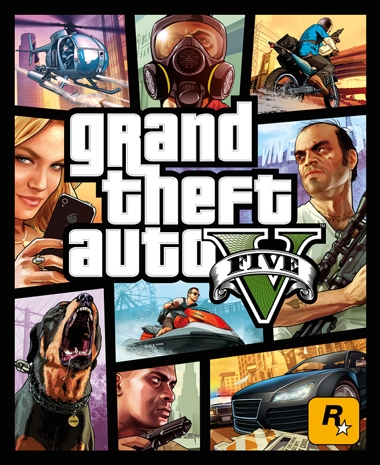
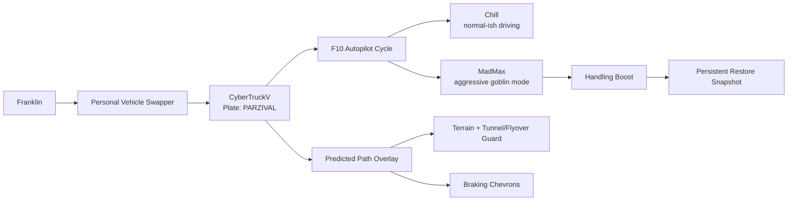

<div align="center">



# GTA FSD

**Full Self Driving, Los Santos edition.**  
Absolutely not approved by Tesla, Rockstar, your insurance company, or the pedestrians of Vinewood Boulevard.


[Install](#install) · [Controls](#controls) · [Architecture](#architecture) · [Credits](#credits) · [Full Guide](./guide.md)

</div>

---

## What Is This?

`GTA FSD` turns Franklin's personal car into a Cybertruck and gives it waypoint autopilot, because Los Santos clearly needed one more questionable transportation startup.

It includes:

- Franklin `buffalo2` replacement with `CyberTruckV`.
- Plate text set to `PARZIVAL`.
- `F10` waypoint autopilot with `Chill` and `MadMax`.
- Tesla-ish predicted path overlay on the road.
- Terrain-following path projection for hills, tunnels, and flyovers.
- Reverse-aware path direction.
- Braking chevrons when the predicted path shrinks.
- MadMax handling boost with snapshot-based restore/recovery.

## Install

Copy these into:

```text
D:\Steam\GTAV\scripts
```

```text
CybertruckWaypointAutopilot.3.cs
CybertruckWaypointAutopilot.ini
FranklinCybertruckPersonalVehicle.3.cs
FranklinCybertruckPersonalVehicle.ini
GTA5_StateStreamer.3.cs
```

Install the Cybertruck DLC at:

```text
D:\Steam\GTAV\mods\update\x64\dlcpacks\CyberTruckV\dlc.rpf
```

Then add this to `dlclist.xml` using OpenIV:

```xml
<Item>dlcpacks:/CyberTruckV/</Item>
```

The full human/Codex reinstall guide lives in [guide.md](./guide.md).

## Controls

| Key | Meaning |
|---|---|
| `F9` | Toggle Franklin Cybertruck personal vehicle swapper |
| `F10` | Cycle `Off -> Chill -> MadMax -> Off` |
| `Insert` | Reload ScriptHookVDotNet scripts |

## Architecture



## Modes

`Chill` is the polite mode. It drives like it has passengers and a Yelp rating.

`MadMax` is the mode that asks, "what if brakes were a suggestion but also extremely powerful?" It temporarily boosts handling, then restores it using a snapshot so the Cybertruck does not remain permanently caffeinated.

## Credits

- Cybertruck vehicle mod: [Cyber Truck 2024 [Add-On | FiveM]](https://www.gta5-mods.com/vehicles/cyber-truck-2024-add-on-fivem) by **VVS797 / 1VVS**.
- Original Assetto Corsa model creator credited by the mod page: **VR Driving**.
- GTA V cover art belongs to **Rockstar Games** and is used here as local documentation artwork. Source page: [Grand Theft Wiki - GTAV Boxart](https://www.grandtheftwiki.com/File:GTAV-Boxart.jpg).
- Scripts/config glue, autopilot behavior, overlay, recovery logic, and this tiny README goblin: local Codex session.

## Tiny Safety Note

Use this in Story Mode. Disable BattleEye. Do not take this into GTA Online unless your goal is to speedrun consequences.

## Codex Redo Checklist

Another Codex should start with [guide.md](./guide.md), then:

```text
1. Copy scripts into D:\Steam\GTAV\scripts
2. Confirm CyberTruckV DLC exists in mods\update\x64\dlcpacks
3. Confirm dlclist.xml includes dlcpacks:/CyberTruckV/
4. Compile-check CybertruckWaypointAutopilot.3.cs
5. Launch Story Mode as Franklin
6. Set waypoint
7. Press F10
8. Pretend this was responsible engineering
```

---

<div align="center">

<sub>GTA FSD: because the future of autonomy is apparently a C# script and a deeply confident triangle on the asphalt.</sub>

</div>
